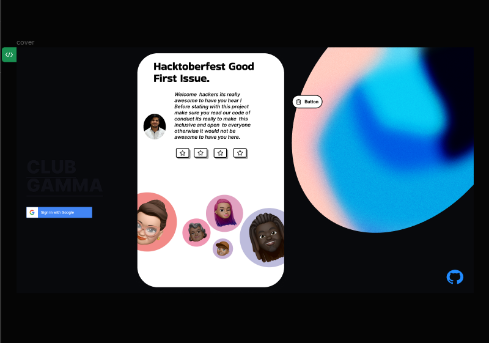

### Description

This Figma design provides a skeleton layout for Good First Issues (GFI) cards for [https://github.com/clubgamma/Good_First_Issue_Web_App]

The design follows a clean and user-friendly approach, with placeholders for essential information.

Figma Link [https://www.figma.com/file/euX49KD1AcOxhLrZUwQH9l/Untitled?type=design&node-id=0-1&mode=design&t=zZ5Tnzz9ZWXkax3P-0]

Preview 

### code

 I have provided a Html/CSS for the design